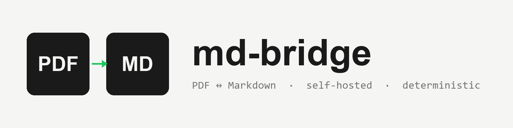
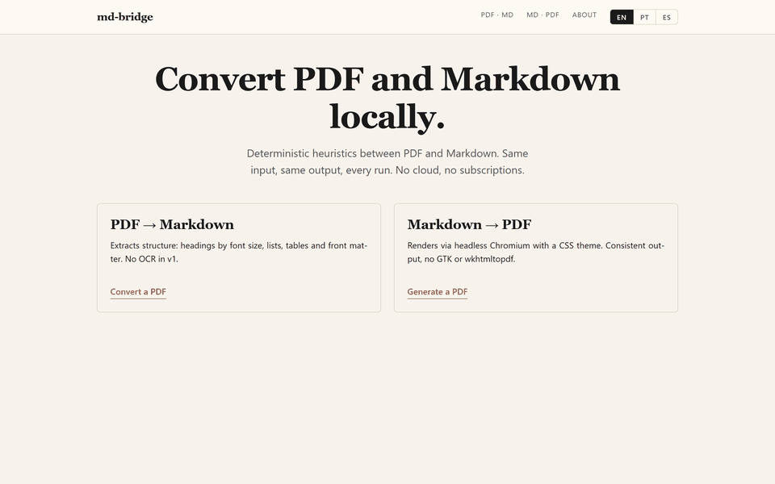
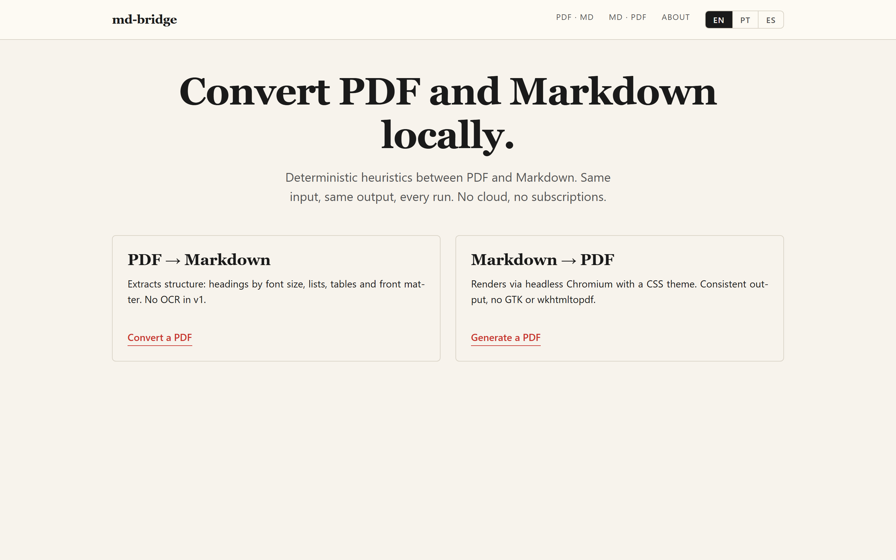
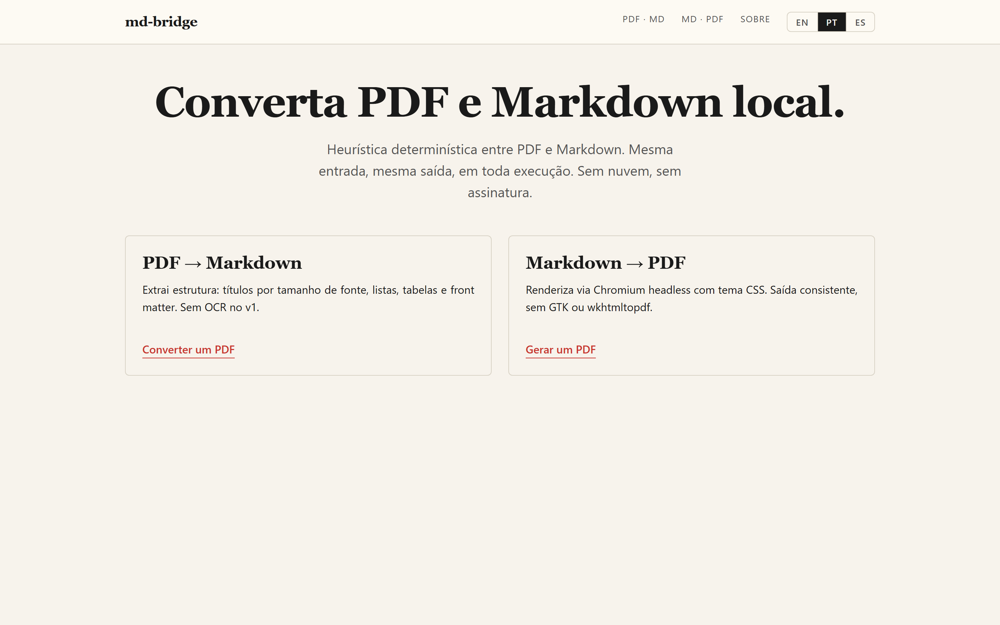
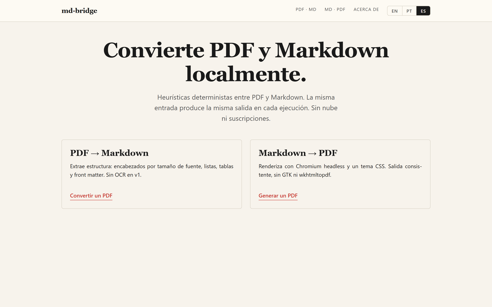
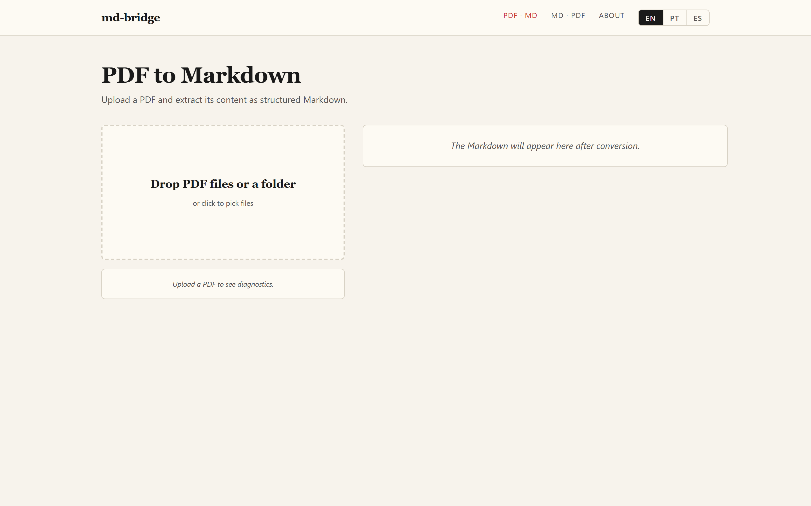
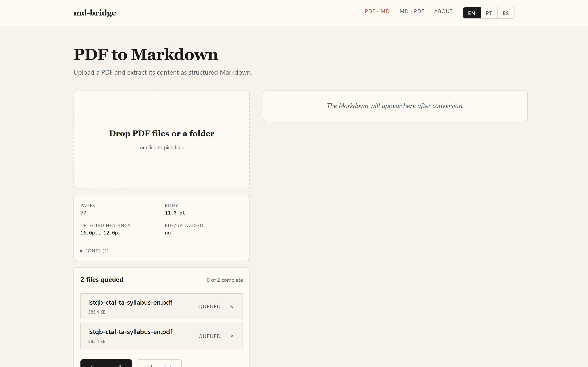
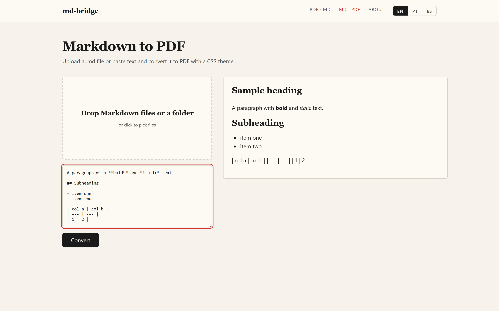
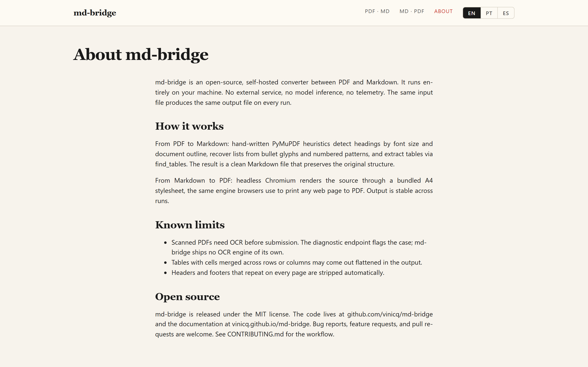
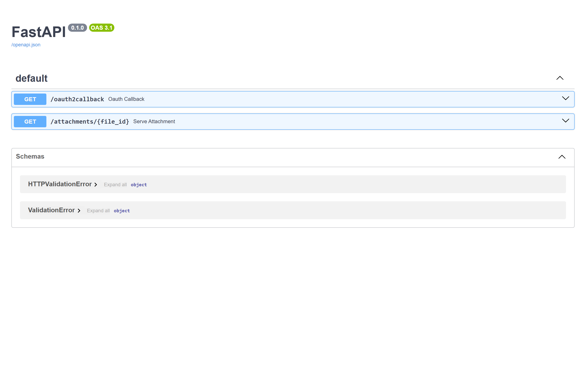

<p align="center">
  
</p>

<p align="center">
  <strong>Self-hosted PDF ↔ Markdown converter.</strong><br>
  Deterministic, heuristic, no external calls.
</p>

<p align="center">
  <a href="https://github.com/vinicq/md-bridge/actions/workflows/ci.yml"></a>
  <a href="https://github.com/vinicq/md-bridge/actions/workflows/codeql.yml"></a>
  <a href="https://scorecard.dev/viewer/?uri=github.com/vinicq/md-bridge"></a>
  <a href="https://www.python.org/downloads/"></a>
  <a href="https://nodejs.org/"></a>
  <a href="LICENSE"></a>
  <a href="#testing"></a>
</p>

<p align="center">
  📖 <a href="https://vinicq.github.io/md-bridge/">Documentation site</a>
  &nbsp;·&nbsp;
  🐳 <a href="https://github.com/vinicq/md-bridge/pkgs/container/md-bridge-api">Docker images on GHCR</a>
  &nbsp;·&nbsp;
  📝 <a href="CHANGELOG.md">Changelog</a>
</p>

---



`md-bridge` is a self-hosted document converter built on hand-written
heuristics: same input, same output, every run. PyMuPDF reads PDFs, headless
Chromium renders Markdown back into print-ready PDFs, FastAPI ties it all
together, and a small React app drives the whole thing from the browser.

The first release ships PDF ↔ Markdown. The architecture is built to
welcome new format pairs as contributions land: DOCX, EPUB, RTF, and
others are natural fits behind the same heuristic-pipeline pattern.

---

## Table of contents

- [Highlights](#highlights)
- [Demo flow](#demo-flow)
- [Tech stack](#tech-stack)
- [Quickstart](#quickstart)
- [Run with Docker](#run-with-docker)
- [Project layout](#project-layout)
- [Running it](#running-it)
- [Testing](#testing)
- [API reference](#api-reference)
- [Screenshots](#screenshots)
- [Internationalization](#internationalization)
- [Contributing](#contributing)
- [License](#license)

## Highlights

- **PDF to Markdown** with heading detection (font size plus PDF outline), list
  recovery (bullet glyphs and numbered patterns), table extraction via
  PyMuPDF's `find_tables`, and YAML front matter for metadata.
- **Markdown to PDF** rendered through headless Chromium (Playwright) using
  a bundled A4 stylesheet at `packages/markdown-to-pdf/templates/default.css`.
- **Batch mode**: drop one file or a whole folder. The UI lists every file,
  converts them in sequence, and lets you download each result as it lands.
- **`/api/inspect-pdf`** returns diagnostics (fonts, sizes, tagged-PDF flag,
  OCR hint) so the UI can warn before conversion.
- **No persistence**, no third-party calls. Every request runs in a
  temporary directory that is removed before the response goes out.
- **Multilingual UI** (English by default, Portuguese and Spanish optional) with a header
  toggle that persists the choice in `localStorage`.
- **Interactive API docs** at `/docs` (Swagger UI) and `/redoc`, plus a
  walkthrough in [`docs/API.md`](docs/API.md).

## Demo flow

```
┌──────────────┐   PDF file   ┌──────────────┐   structured MD   ┌──────────────┐
│  React UI    │ ───────────▶ │  FastAPI     │ ────────────────▶ │  Browser     │
│  (Vite)      │              │  /api/...    │                   │  download    │
└──────┬───────┘              └──────┬───────┘                   └──────────────┘
       │                              │
       │       imports (no rewrite)   │
       ▼                              ▼
┌────────────────────────────────────────────┐
│  packages/pdf-to-markdown   (heuristic)    │
│  packages/markdown-to-pdf   (Chromium)     │
└────────────────────────────────────────────┘
```

## Tech stack

| Layer        | Choice                                     |
| ------------ | ------------------------------------------ |
| Backend      | FastAPI, Pydantic v2, Uvicorn              |
| Conversion   | PyMuPDF, pypdf, Python-Markdown, Playwright|
| Frontend     | Vite, React, TypeScript, React Router 6    |
| Styling      | Plain CSS with design tokens, no framework |
| Tests        | pytest, Vitest, React Testing Library, Playwright |
| i18n         | Lightweight context provider, EN plus PT/ES |

## Quickstart

You will need:

- Python 3.12 or newer
- Node 22 and npm 10 or newer

The commands below work the same on macOS, Linux, and Windows once the
virtual environment is activated. Activate scripts differ by shell:

```bash
# 1. Backend: create the virtual environment
cd apps/api
python -m venv .venv

# Activate it (pick the line for your shell):
source .venv/bin/activate                   # macOS / Linux / Git Bash
# .venv\Scripts\Activate.ps1                # Windows PowerShell

# Install the backend and the converter dependencies:
python -m pip install -e ".[dev]"
python -m playwright install chromium

# 2. Frontend
cd ../web
npm install
npx playwright install chromium

# 3. Root-level helper (lets you start API and UI together)
cd ../..
npm install

# 4. Boot the dev servers: API on port 8000, Vite on port 5173
npm run dev
```

Open `http://localhost:5173` for the UI and `http://localhost:8000/docs`
for the interactive API documentation.

## Run with Docker

One command brings the API and the web UI up together:

```bash
docker compose up
```

To pull pre-built images from GHCR instead of building locally:

```bash
docker pull ghcr.io/vinicq/md-bridge-api:latest
docker pull ghcr.io/vinicq/md-bridge-web:latest
```

Each release also gets pinned tags (`0.1.1`, `0.1`, etc.).

### Deploying to a free cloud VM

`deployment/oracle-cloud/` ships a complete recipe for running md-bridge
on the **Oracle Cloud Always Free** tier (4 OCPU ARM + 24 GB RAM, US$0
forever). One bootstrap script installs Docker, Caddy, and the stack;
HTTPS is automatic via Let's Encrypt. See the
[walkthrough](deployment/oracle-cloud/README.md) or the
[docs site](https://vinicq.github.io/md-bridge/deployment/oracle-cloud/).

The API listens on `http://localhost:8000` and the web UI on
`http://localhost:5173`. The web container waits for the API healthcheck
before starting, so the first call from the browser already has a live
backend behind it.

The compose stack runs the application, not the test suite by default.
The healthchecks on each container only confirm that the service is
reachable, not that it behaves correctly.

If you do not have Python or Node installed locally and want to run the
tests anyway, an opt-in `test` profile spins up ephemeral containers that
execute pytest and vitest:

```bash
docker compose --profile test run --rm tests-api   # backend pytest
docker compose --profile test run --rm tests-web   # frontend vitest
```

Both containers exit when the suite finishes; nothing keeps running in
the background. Playwright end-to-end tests are not part of the compose
profile (they need a real browser session and a running API). They live
in CI (GitHub Actions, see [`.github/workflows/ci.yml`](.github/workflows/ci.yml))
and run locally through `npm run test:e2e`.

## Project layout

```
md-bridge/
├── apps/
│   ├── api/          FastAPI service: routes, services, schemas, tests
│   └── web/          React app: pages, components, hooks, tests, e2e specs
├── packages/
│   ├── pdf-to-markdown/   Vendored converter (PyMuPDF heuristics)
│   └── markdown-to-pdf/   Vendored renderer (Chromium via Playwright)
├── tests/            Conversion-layer regression with golden files
├── docs/
│   └── API.md        REST walkthrough
├── docker-compose.yml
├── package.json      Root scripts (`npm run dev`, `npm run test:all`)
└── README.md
```

## Running it

```bash
# Both servers in parallel (recommended for local dev)
npm run dev

# Or one at a time:
npm run dev:api           # FastAPI with auto-reload on :8000
npm run dev:web           # Vite on :5173 (proxies /api to :8000)
```

Production build for the frontend:

```bash
npm run build             # writes apps/web/dist/
```

For a production API run, drop `--reload` and pin a process manager of your
choice. The command assumes the virtual environment is already activated:

```bash
python -m uvicorn app.main:app --port 8000 --app-dir apps/api
```

## Testing

The test suite follows a classic pyramid with 124 tests in total, every one
of which runs on CI against the committed ISTQB CTAL-TA syllabus fixture. No
mocks of the API, fetch, or browser primitives: integration runs against the
real FastAPI TestClient and E2E drives a real Chromium against a real
backend.

| Tier        | Count | What it covers                                                   |
| ----------- | ----- | ---------------------------------------------------------------- |
| Unit        | 92    | 46 backend (schemas, helpers, errors, heuristics) + 46 frontend (components, hooks, i18n) |
| Integration | 26    | 14 backend with FastAPI TestClient + 3 regression goldens + 9 frontend page tests (Home, About, Navigation, batch panel) |
| E2E         | 6     | Playwright real-browser specs: ISTQB conversion, md-to-pdf, language toggle, batch with two files |

Run them with:

```bash
npm run test:unit                   # 46 backend + 46 frontend = 92 unit tests
npm run test:unit:api               # backend unit (pytest, apps/api/tests/unit)
npm run test:unit:web               # frontend unit (Vitest)

npm run test:integration            # backend + regression goldens + frontend pages = 26
npm run test:integration:api        # FastAPI TestClient (apps/api/tests/integration)
npm run test:integration:regression # 3 golden-file regressions (tests/regression)
npm run test:integration:web        # frontend page tests (Home, About, Navigation, batch)

npm run test:e2e                    # 6 Playwright real-browser specs

npm run test:all                    # everything in sequence
```

The integration tier uses a real-world fixture: the ISTQB CTAL-TA EN
syllabus (`apps/api/tests/fixtures/istqb-ctal-ta-syllabus-en.pdf`). It
exercises the heuristic converter against a long, table-heavy, outline-rich
PDF that is representative of the documents users care about. Every test
runs against this fixture, so there are no silent skips on CI.

Regression snapshots live under `tests/golden/`. After a deliberate change
to the heuristics, regenerate them with the virtual environment active:

```bash
python -m pytest tests/regression --update-golden
```

## API reference

The FastAPI app ships with two built-in doc viewers:

- **Swagger UI** (try-it-out playground): `http://localhost:8000/docs`
- **ReDoc** (long-form reference): `http://localhost:8000/redoc`

A walkthrough with `curl` examples and the full error envelope catalogue
lives in [`docs/API.md`](docs/API.md).

Quick sample, convert a PDF:

```bash
curl -X POST http://localhost:8000/api/pdf-to-md \
  -F "file=@whitepaper.pdf" \
  -F 'options={"front_matter": true}'
```

Quick sample, render Markdown back to PDF:

```bash
curl -X POST http://localhost:8000/api/md-to-pdf \
  -F "file=@notes.md" \
  --output notes.pdf
```

## Screenshots

### Home page across locales

| English | Portuguese | Spanish |
|---|---|---|
|  |  |  |

### Conversion flow

| | |
|---|---|
| **PDF to Markdown** (idle) | **Batch mode**, two PDFs queued |
|  |  |
| **Markdown to PDF** flow | **About page** |
|  |  |
| **Swagger UI** at `/docs` | |
|  | |

## Internationalization

The UI ships with English (default), Portuguese, and Spanish. The header carries a
locale toggle (`EN` / `PT` / `ES`); the choice is persisted in `localStorage`
under `md-bridge:locale`.

To add a new locale:

1. Open `apps/web/src/i18n/dictionaries.ts`.
2. Add a new entry to the `Locale` union and to the `LOCALES` array.
3. Translate the `Dictionary` shape and add it to `DICTIONARIES`.

The header toggle picks the new locale up automatically.

## Limits

- 500 MB cap per upload
- nginx reverse proxy waits up to 10 minutes per request, which fits very
  large PDFs end-to-end
- No OCR yet: scanned PDFs need Tesseract before being submitted
- Tables with merged cells can be flattened by the heuristic extractor

## Contributing

Issues and pull requests are welcome. Read [CONTRIBUTING.md](CONTRIBUTING.md)
for the full guide; the headline rules are:

- Every behaviour change ships with tests at the lowest viable tier.
- Pull requests stay small and aim for at most three commits.
- AI assistants are tools, not co-authors: do not add `Co-Authored-By`
  trailers for them.
- Use Python 3.12+ idioms and TypeScript strict mode; keep comments for the
  non-obvious "why".

If you found a security issue, please follow [SECURITY.md](SECURITY.md)
instead of opening a public issue.

## License

MIT, see [`LICENSE`](LICENSE).

## Contributors

Thanks goes to these people for code, translations, docs, design, and
review work on md-bridge ([emoji key](https://allcontributors.org/docs/en/emoji-key)):

<!-- ALL-CONTRIBUTORS-LIST:START - Do not remove or modify this section -->
<!-- prettier-ignore-start -->
<!-- markdownlint-disable -->
<table>
  <tbody>
    <tr>
      <td align="center" valign="top" width="14.28%">
        <a href="https://github.com/vinicq">
          
          <br /><sub><b>Vinicius Queiroz</b></sub>
        </a><br />
        <a href="#code" title="Code">💻</a>
        <a href="#doc" title="Documentation">📖</a>
        <a href="#design" title="Design">🎨</a>
        <a href="#infra" title="Infrastructure">🚇</a>
        <a href="#maintenance" title="Maintenance">🚧</a>
        <a href="#review" title="Reviewed Pull Requests">👀</a>
        <a href="#test" title="Tests">⚠️</a>
      </td>
      <td align="center" valign="top" width="14.28%">
        <a href="https://github.com/zhouzhou626">
          
          <br /><sub><b>zhouzhou626</b></sub>
        </a><br />
        <a href="#code" title="Code">💻</a>
        <a href="#translation" title="Translation">🌍</a>
        <a href="#test" title="Tests">⚠️</a>
      </td>
    </tr>
  </tbody>
</table>
<!-- markdownlint-restore -->
<!-- prettier-ignore-end -->
<!-- ALL-CONTRIBUTORS-LIST:END -->

This project follows the
[all-contributors](https://github.com/all-contributors/all-contributors)
specification. Contributions of every kind welcome.

---

## If md-bridge helped you

A star ⭐ on GitHub is the single most useful thing you can do; it makes the
project discoverable for the next person looking for a self-hosted PDF
converter.

### Star history

<a href="https://www.star-history.com/#vinicq/md-bridge&Date">
  <picture>
    <source media="(prefers-color-scheme: dark)" srcset="https://api.star-history.com/svg?repos=vinicq/md-bridge&type=Date&theme=dark">
    <source media="(prefers-color-scheme: light)" srcset="https://api.star-history.com/svg?repos=vinicq/md-bridge&type=Date">
    
  </picture>
</a>
