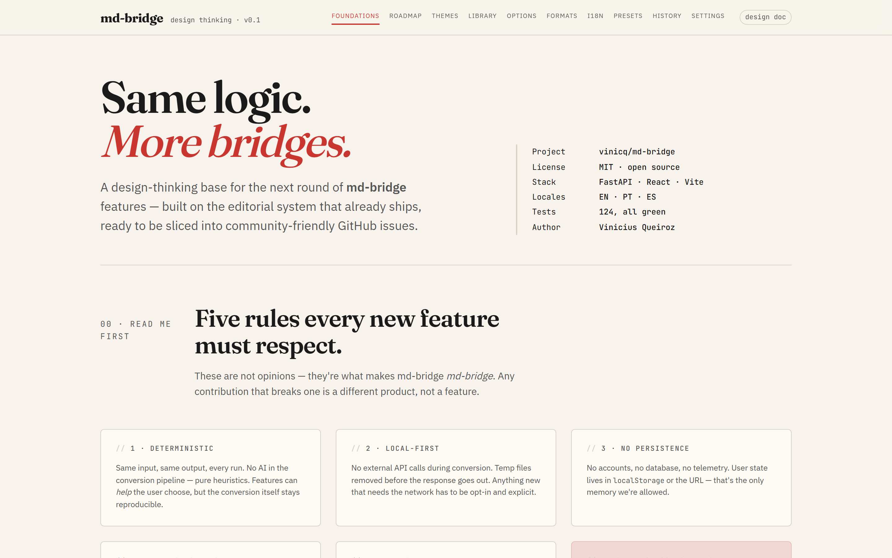
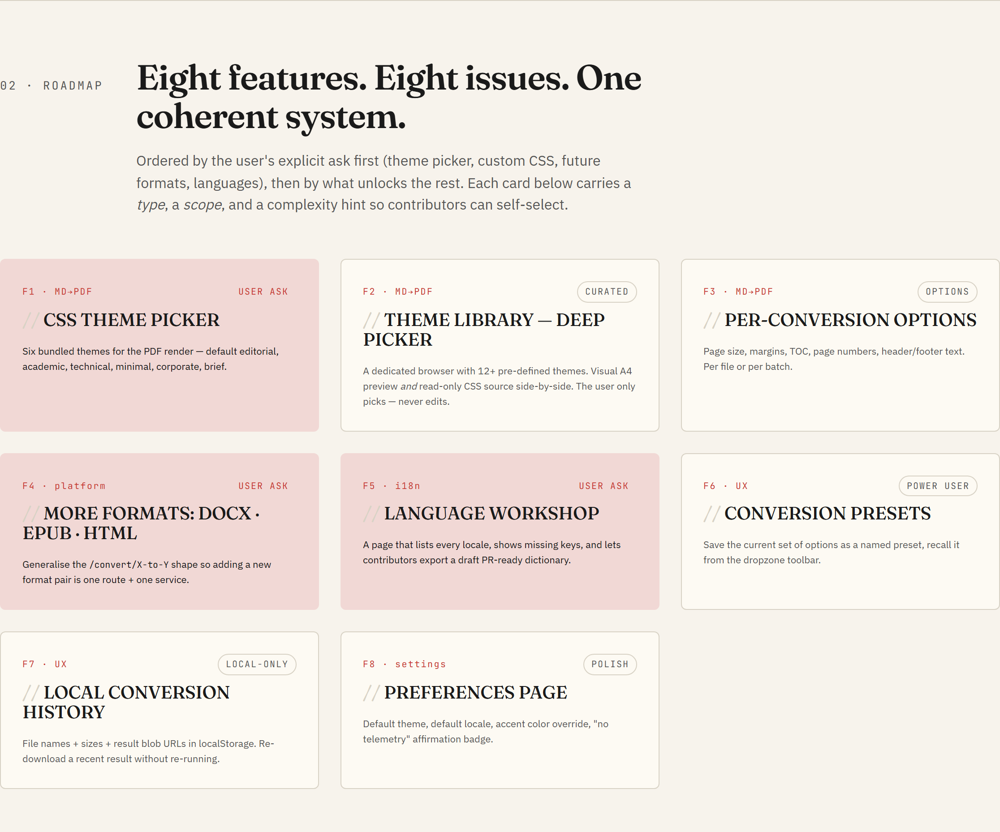

# md-bridge design system

This directory holds the visual catalogue for every UI feature that
ships or is planned for md-bridge.

## Roadmap at a glance

| Section | Feature |
|---|---|
| [F1](design-thinking.html#f1) | CSS theme picker for Markdown → PDF |
| [F2](design-thinking.html#f2) | Theme library (deep picker with code preview) |
| [F3](design-thinking.html#f3) | Per-conversion options panel |
| [F4](design-thinking.html#f4) | Format hub (DOCX, EPUB, HTML, RTF) |
| [F5](design-thinking.html#f5) | Language workshop |
| [F6](design-thinking.html#f6) | Conversion presets |
| [F7](design-thinking.html#f7) | Local conversion history |
| [F8](design-thinking.html#f8) | Preferences page |

## Files

| File | Purpose |
|---|---|
| `design-thinking.html` | The catalogue. Self-contained HTML, opens in any browser. |
| `index.md` | The landing page rendered on the [docs site](https://vinicq.github.io/md-bridge/design/) with the full per-feature gallery. |
| `screenshots/` | Retina captures of every catalogue section, used by the gallery. |
| `README.md` | You are here. |

## Open the catalogue

- **Online (recommended):** <https://vinicq.github.io/md-bridge/design/design-thinking.html>
- **Locally:** open `design-thinking.html` in any browser. No build step,
  no dependencies. Fonts load from Google Fonts on first view.

## What is inside

Eight features (F1–F8) covering theme picker, theme library, options
panel, format hub (DOCX/EPUB/HTML/RTF), language workshop, presets,
history, and a preferences page. Each feature has a hi-fi mockup and a
paste-ready issue body.

The catalogue reuses the React app's design tokens verbatim
(`apps/web/src/styles/tokens.css`), so token changes propagate visually
when you rebuild the HTML block.

## Contributing to the design

See [`index.md`](index.md#how-to-propose-a-ui-feature) for the
workflow. Short version:

- Picking up an open `design-required` issue? Match the mockup.
- Proposing something new? Open a feature-request issue with a sketch.

## Editing the HTML

`design-thinking.html` is generated by [Claude Design](https://claude.ai/design)
and committed as-is. To revise a feature, run a new design pass and
replace the file in one commit.

Token block lives at the top of the `<style>` element in the HTML and
should be kept in sync with `apps/web/src/styles/tokens.css`. The
commit that touches the tokens should touch both files.
