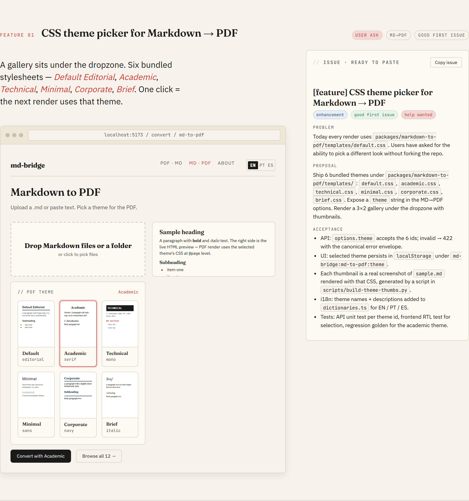
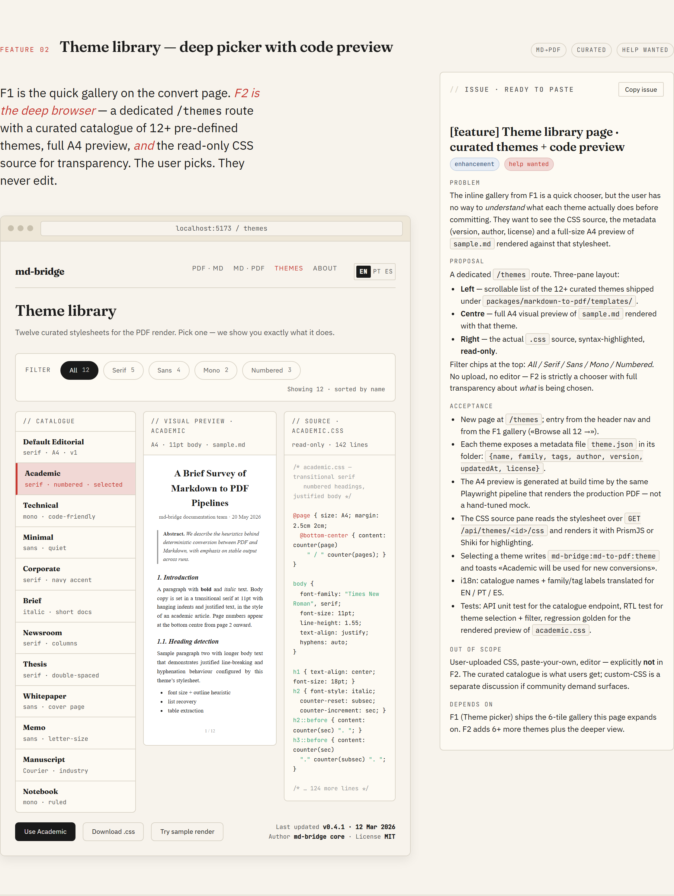
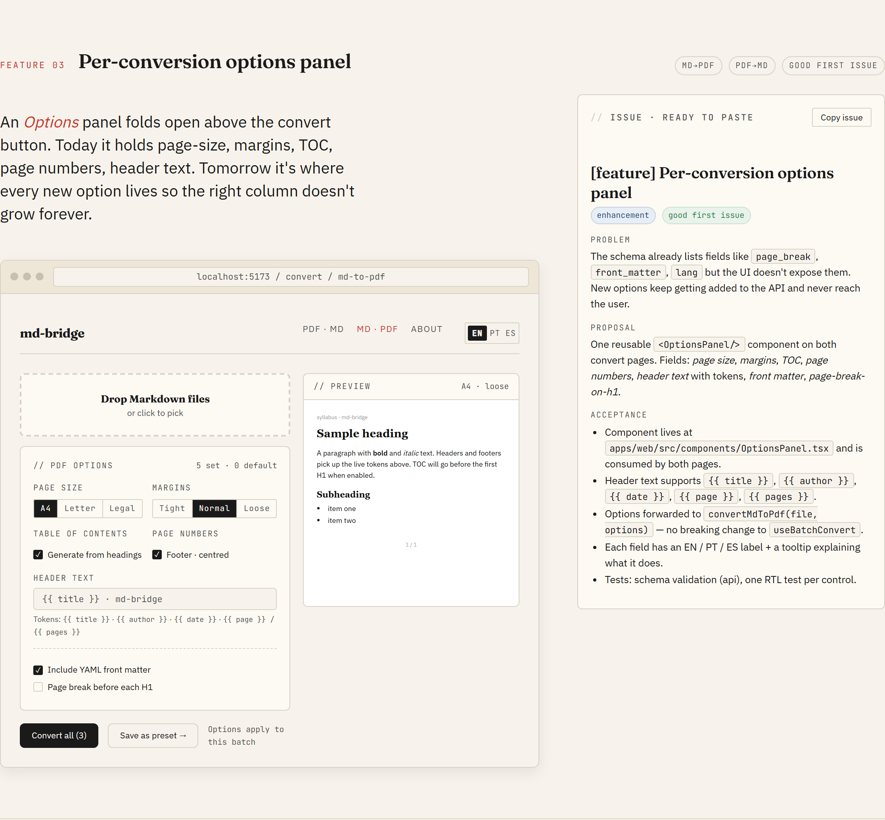
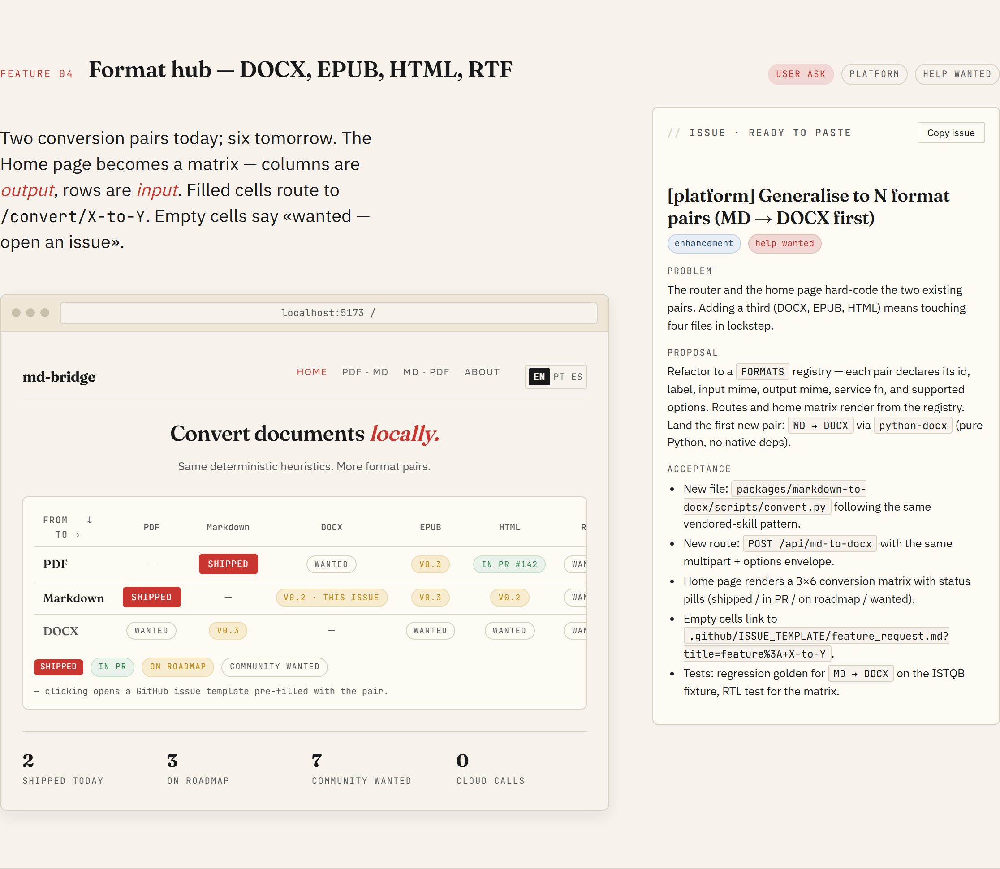
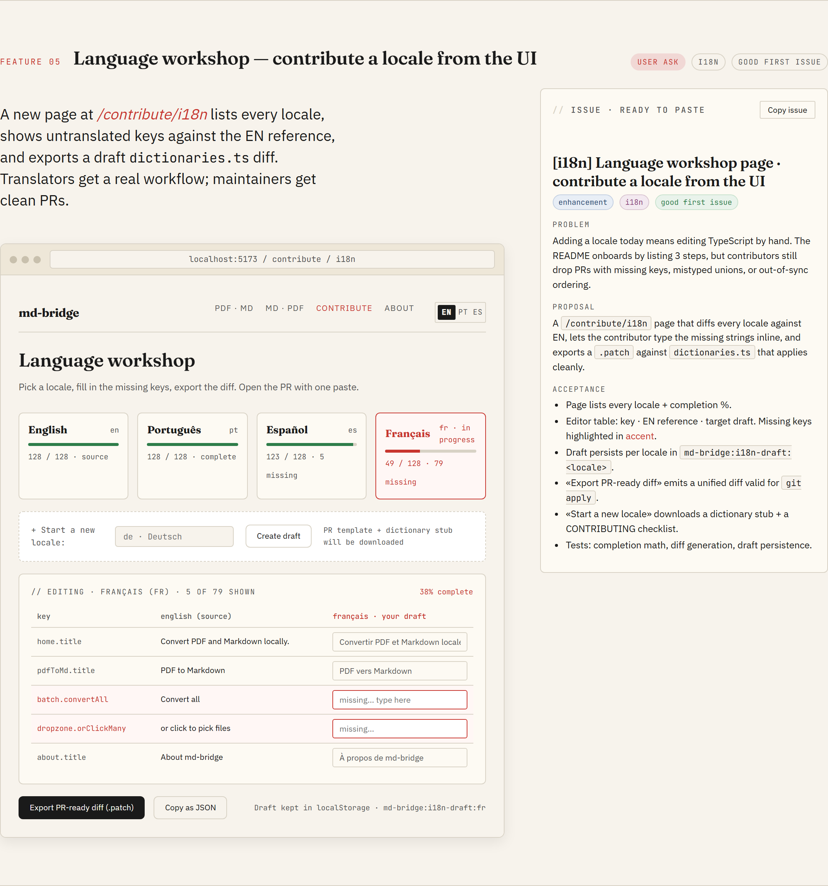
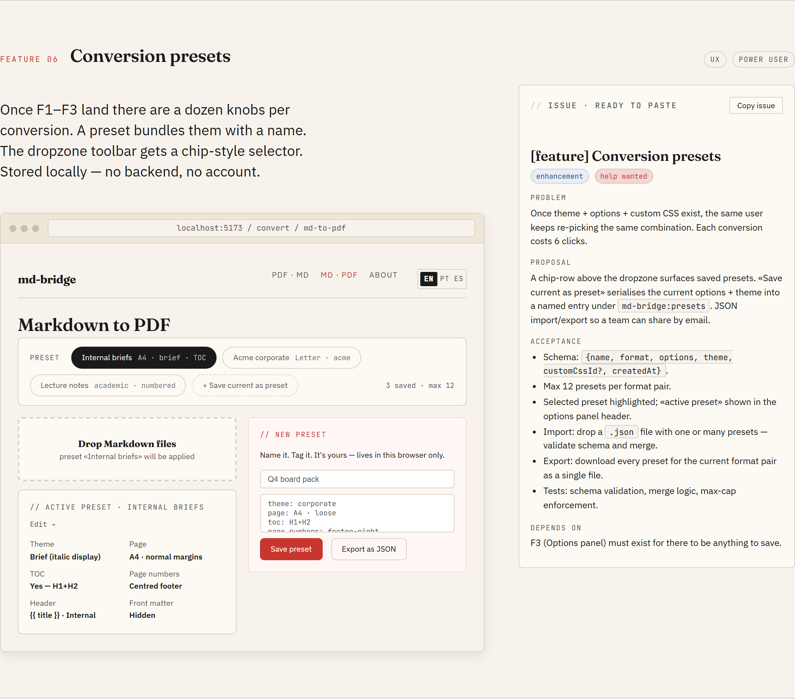
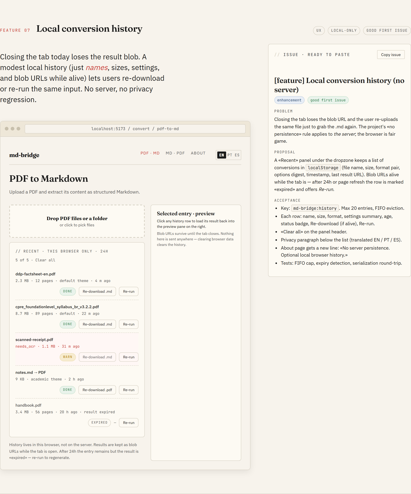
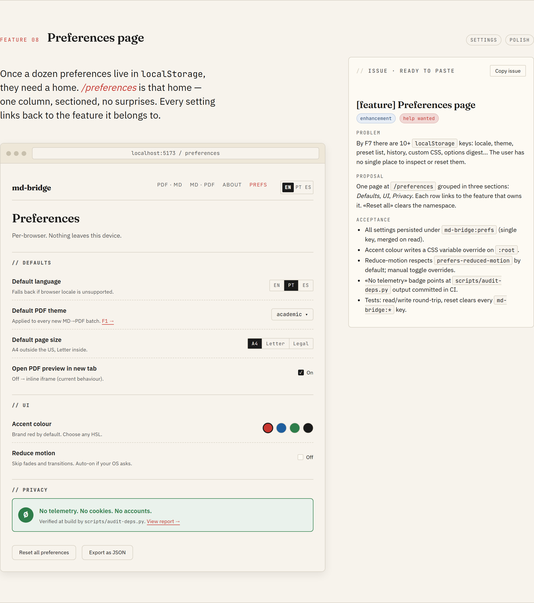
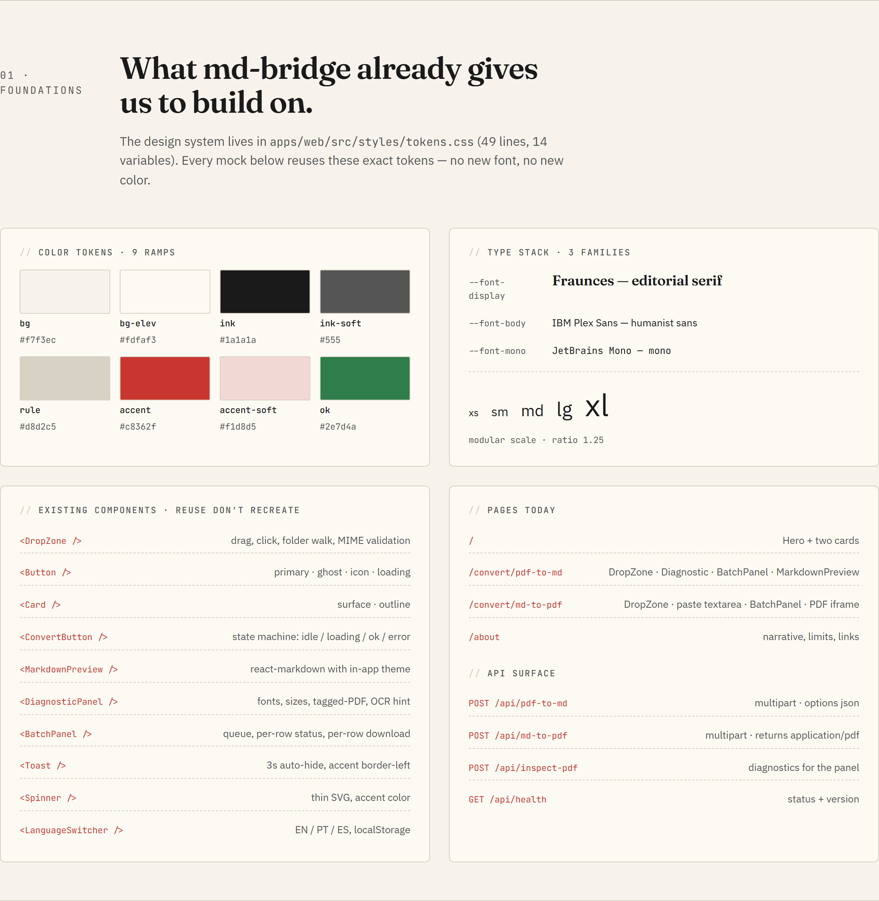

---
hide:
  - navigation
---

# Design system

Every UI change in md-bridge tracks back to a mockup in this catalogue.
The catalogue lives as a single self-contained HTML file
([`design-thinking.html`](design-thinking.html)) that reuses the same
design tokens as the React app (`apps/web/src/styles/tokens.css`), so
when the tokens move the mockups move with them.

[Open the design catalogue →](design-thinking.html){ .md-button .md-button--primary }

## Roadmap at a glance

## Principles

Five rules every new feature must respect. They are not stylistic, they
are the things that make md-bridge useful in the first place:

1. **Deterministic.** Same input, same output, every run. No model, no
   randomness, no time-of-day branching.
2. **Local-first.** Nothing leaves the user's machine. Conversions run
   in a temp directory and the directory is wiped before the response
   is sent back.
3. **No persistence.** The server holds zero state between requests.
   Anything a user wants to keep (themes, presets, history) lives
   client-side, in `localStorage` or in the browser file system.
4. **Heuristic, not statistical.** The conversion code is hand-written
   rules. New features extend the rules; they do not introduce trained
   models or third-party inference calls.
5. **Editorial UI.** Type-driven, calm, restrained. The serif
   wordmark, the warm paper background, and the single accent red are
   the visual contract; new screens fit inside it, not around it.

## What is in the catalogue

Eight features, each with a full mockup and a paste-ready issue body.
The catalogue header carries a scroll-spy nav, so you can jump straight
to the feature you care about. Each feature page has two columns: the
hi-fi mockup on the left, the issue spec on the right. The **Copy
issue** button on each spec gives you the exact markdown to paste into
a new GitHub issue.

### F1 · CSS theme picker for Markdown → PDF

### F2 · Theme library (deep picker with code preview)

### F3 · Per-conversion options panel

### F4 · Format hub (DOCX, EPUB, HTML, RTF)

### F5 · Language workshop

### F6 · Conversion presets

### F7 · Local conversion history

### F8 · Preferences page

## Foundations

The "Foundations" section of the catalogue inventories what already
ships: tokens, type scale, component primitives, routes, and API
endpoints. Every new feature reuses them before adding anything new.

## How to propose a UI feature

The workflow has two paths.

### Picking up an existing `design-required` issue

1. Open the issue and read the body.
2. Scan the catalogue for the matching F-section (the maintainer will
   usually drop a link in the issue thread).
3. Implement against the mockup. Match the visual output; do not copy
   the HTML structure verbatim. The prototype is for visual reference;
   the React tree is up to you.
4. Open the PR. Reference the issue and link the catalogue section in
   the description.

### Proposing a brand-new UI change

1. Open a feature-request issue with a sketch (Excalidraw, plain PNG,
   even ASCII).
2. The maintainer decides whether the change slots into an existing
   F-section or warrants a fresh design pass.
3. If a new design pass is needed, the maintainer runs it (see below)
   and updates the catalogue. The issue gets the `design-required`
   label so contributors know to wait for the mockup.

## How the catalogue gets updated

The HTML in `docs/design/design-thinking.html` was generated with
[Claude Design](https://claude.ai/design), an AI design tool that
produces HTML/CSS/JS prototypes. The maintainer iterates inside the
tool, the tool exports a self-contained HTML bundle, and that bundle
replaces the file in this directory.

If a feature in the catalogue needs revision (visual bug, missing
state, broken responsive behaviour), open an issue with the screenshot
and the F-section number. Edits to the catalogue ship as their own
commit so the design history stays inspectable in git.

## Token contract

The HTML in the catalogue declares its CSS variables at the top of
its `<style>` block, copied verbatim from
[`apps/web/src/styles/tokens.css`](https://github.com/vinicq/md-bridge/blob/main/apps/web/src/styles/tokens.css).
Anything that ships in the React app uses the same variables. Two
consequences:

- Changing a token in `tokens.css` automatically changes the React app.
  The catalogue holds its own copy and needs a manual sync; the commit
  that updates the tokens should update the HTML block in the same PR.
- New tokens added to `tokens.css` should land in the catalogue HTML
  at the same time, otherwise mockups using them will fall back to
  defaults.

## Why a single HTML file

A static, self-contained HTML is the lowest-friction format for a
design catalogue inside an open-source repo:

- Anyone can view it in a browser, no build step, no node_modules.
- Diffs are readable in PRs: token changes and copy edits show up as
  plain lines.
- GitHub Pages serves it as-is, so the public URL is the same as the
  raw repo file.
- The format the design tool ships matches the format we commit, so
  there is no transformation step that can desync.

The alternative (Figma, Penpot, a Storybook tree) adds tooling weight
that does not pay for itself at the project's current size.
